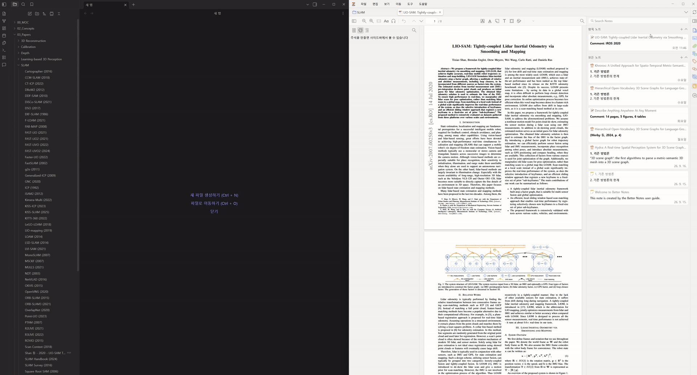
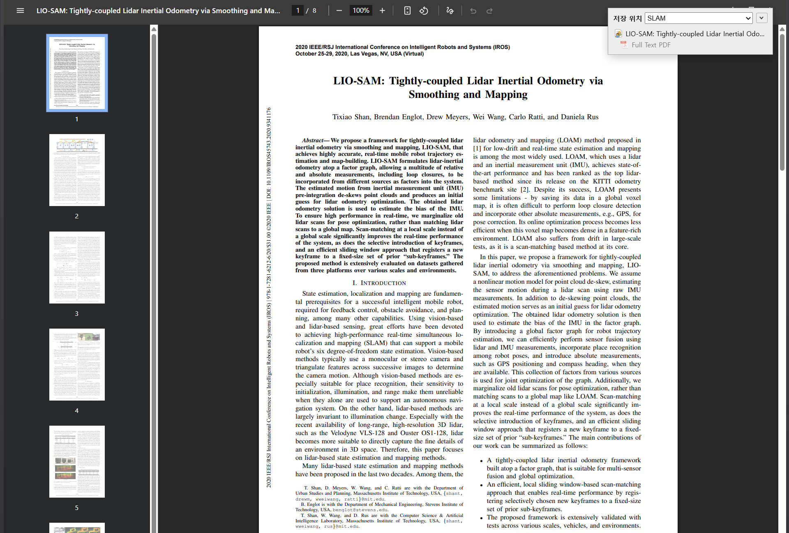
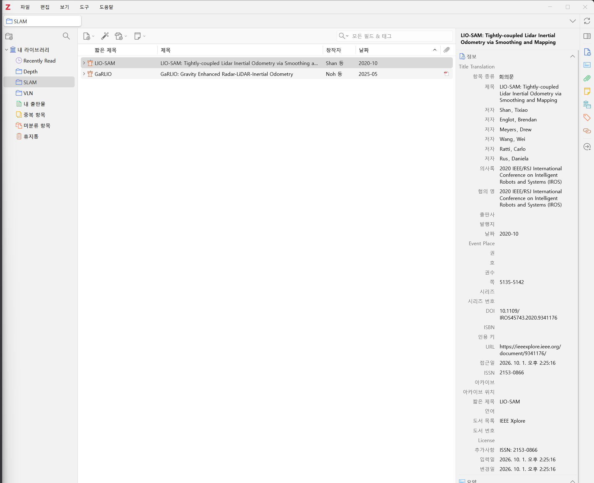
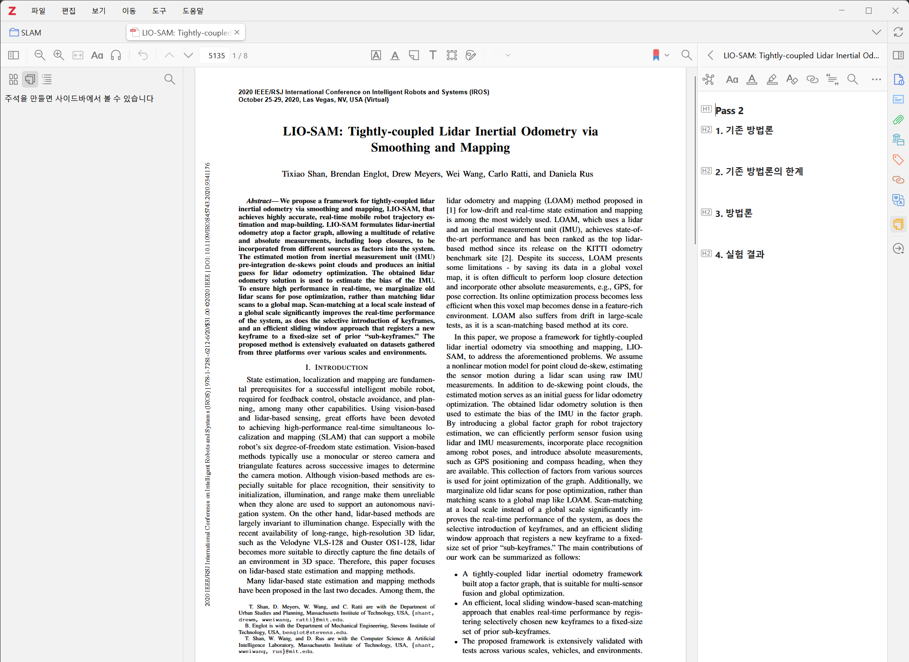
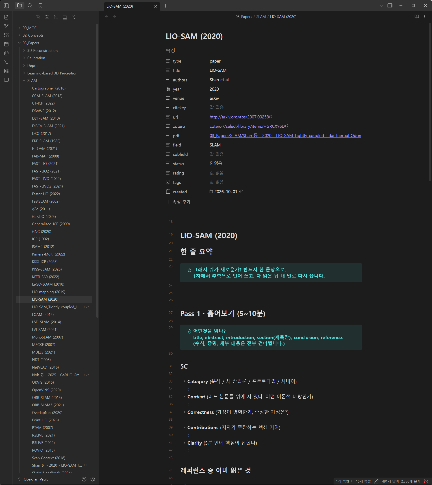

# zotero2obsidian-autosync

S. Keshav의 [How to Read a Paper](https://web.stanford.edu/class/ee384m/Handouts/HowtoReadPaper.pdf)(three-pass 읽기법)를 Zotero와 Obsidian에서 그대로 따라 할 수 있게 만든 **논문 노트 템플릿**과, Zotero에서 정리한 노트를 Obsidian으로 **자동 동기화**하는 도구입니다. Windows 전용입니다.



## 이 논문 읽기법을 따라가는 노트

논문을 한 번에 끝까지 읽는 대신, 목적이 다른 세 번의 패스로 나눠 읽는 방법입니다. 논문마다 노트가 하나씩 생기고, 노트는 세 패스 순서로 구성되어 있어서 위에서 아래로 채우면 됩니다.

| 패스 | 걸리는 시간 | 하는 일 | 어디서 쓰나 |
|---|---|---|---|
| **Pass 1** 훑어보기 | 5~10분 | 제목·초록·서론·결론만 보고 5C(Category, Context, Correctness, Contributions, Clarity)를 적고, 계속 읽을지 정합니다 | Obsidian |
| **Pass 2** 내용 파악 | 약 1시간 | 그림과 표를 보며 기존 방법론, 그 한계, 이 논문의 방법론, 실험 결과를 정리합니다. 수식 증명은 건너뜁니다 | **Zotero** → Obsidian에 자동 동기화 |
| **Pass 3** 가상으로 다시 써보기 | 1~5시간 | 저자와 같은 가정에서 출발해 직접 다시 만들어 보고, 원문과 비교해 숨은 가정과 한계를 찾습니다 | Obsidian |

Pass 2만 Zotero에서 쓰는 이유는 논문 PDF와 그림 옆에서 정리하는 게 편하기 때문입니다. 나머지는 Obsidian에서 바로 씁니다. 이 둘이 한 노트로 합쳐지도록 동기화 도구가 중간을 이어 줍니다.

### 한눈에 보는 흐름

<table>
<tr>
<td width="50%" valign="top"><br><b>1. 논문 저장</b><br>브라우저에서 Zotero Connector로 논문을 저장합니다. 저장할 <b>컬렉션</b>이 볼트의 폴더가 됩니다.</td>
<td width="50%" valign="top"><br><b>2. Zotero에 추가됨</b><br>서지 정보가 채워집니다. <b>짧은 제목</b>(Short Title)이 Obsidian 노트 이름이 됩니다.</td>
</tr>
<tr>
<td width="50%" valign="top"><br><b>3. Pass 2 노트</b><br>PDF 옆에 1~4번 헤더가 들어 있는 Pass 2 노트가 생깁니다. 여기에 정리합니다.</td>
<td width="50%" valign="top"><br><b>4. Obsidian 노트</b><br>볼트에 논문 노트가 생기고 속성이 채워집니다. Pass 2 내용은 몇 초 안에 따라옵니다.</td>
</tr>
</table>

3번의 Pass 2 노트는 우클릭으로 직접 만들거나, 아래 [Pass 2 노트 자동 생성](#선택-pass-2-노트-자동-생성)을 설정해 자동으로 만듭니다.

### 노트 템플릿 구성

[`obsidian/paper-note.md`](obsidian/paper-note.md)가 Obsidian 노트 템플릿이고, [`zotero/pass2-note-template.html`](zotero/pass2-note-template.html)이 Zotero의 Pass 2 노트 템플릿입니다.

| 영역 | 내용 |
|---|---|
| 속성 | `title`, `authors`, `year`, `venue`, `url`, `zotero`, `pdf` 등은 자동으로 채워집니다. `pass`(끝낸 패스, 예: `1`, `2`, `3`)와 `status`(안읽음 → 정리됨)는 직접 씁니다 |
| 한 줄 요약 | "그래서 뭐가 새로운가?"를 한 문장으로. Pass 1에서 추측으로 먼저 쓰고, 다 읽은 뒤 내 말로 다시 씁니다 |
| Pass 1 | 5C, 레퍼런스 중 이미 읽은 것, 계속 읽을지 체크리스트 |
| Pass 2 | Zotero에서 오는 1~4번 섹션(기존 방법론 / 한계 / 방법론 / 실험 결과), 핵심 주장과 근거 표, 막힌 곳 |
| Pass 3 | 가정 목록, 나라면 이렇게 했다, 내 생각과 논문의 한계, 내 글쓰기에 가져갈 것 |
| 관련 개념, 읽고 나면 | 이 논문의 기여가 걸린 개념, 마무리 체크리스트 |

## 자동 동기화

Zotero에 논문을 추가하면 Obsidian 볼트에 논문 노트가 자동으로 생기고, Zotero에서 정리한 Pass 2 노트가 그 노트 안으로 계속 동기화됩니다.

- 새 논문 → 템플릿으로 노트 생성, 속성(저자·연도·학회·URL·Zotero 링크·PDF 링크) 자동 입력
- Zotero의 Pass 2 노트(1~4번 섹션) → Obsidian 노트의 같은 이름 헤더 밑으로 복사, 그림 포함
- Zotero 컬렉션 → 볼트의 폴더 (`Papers/<컬렉션>/`)
- Obsidian 플러그인이 필요 없습니다. 로그온할 때 작업 스케줄러가 감시 스크립트를 띄우고, Zotero에서 무언가 바뀌면 **몇 초 안에** 동기화합니다.

```
Zotero (로컬 API) ◀──5초마다 확인── scripts/zotero_watch.ps1 ──바뀌면──▶ scripts/zotero_sync.ps1 ──▶ 볼트의 .md 파일
```

감시 스크립트는 5초마다 "가장 최근에 바뀐 아이템 하나"만 물어봐서 가볍습니다. 바뀐 게 있으면 입력이 5초 동안 멈출 때까지 기다렸다가 한 번 동기화합니다. Zotero에서 노트를 만들거나 고치면 보통 10초 안에 Obsidian에 반영됩니다.

## 준비물

| | |
|---|---|
| Windows 10/11 | PowerShell 5.1 (기본 설치) 사용 |
| [Zotero](https://www.zotero.org/) 7 이상 | 로컬 API가 필요합니다 |
| [Better Notes](https://github.com/windingwind/zotero-better-notes) (Zotero 플러그인) | Pass 2 노트를 템플릿으로 만들 때 사용. 없어도 노트 헤더만 맞으면 동작합니다 |
| [Actions & Tags](https://github.com/windingwind/zotero-actions-tags) (선택) | Pass 2 노트를 자동으로 만들 때 사용. 아래 "Pass 2 노트 자동 생성" 참고 |
| [ZotMoov](https://github.com/wileyyugioh/zotmoov) (선택) | PDF를 볼트 안으로 옮겨 두면 노트에 `pdf:` 링크가 걸립니다 |
| Obsidian | 플러그인은 필요 없습니다 |

## 설치

1. 이 저장소를 받습니다. 설치 후에도 이 폴더에서 스크립트가 실행되니 지우지 마세요.
   ```
   git clone https://github.com/meteor0108/zotero2obsidian-autosync.git
   ```
2. **Zotero를 완전히 끕니다.** 켜져 있으면 Zotero가 닫힐 때 바뀐 설정을 덮어씁니다.
3. 설치 스크립트를 실행합니다.
   ```powershell
   powershell -ExecutionPolicy Bypass -File install.ps1 -VaultPath "C:\Users\me\Documents\Obsidian Vault"
   ```
   | 옵션 | 기본값 | 뜻 |
   |---|---|---|
   | `-PapersFolder` | `Papers` | 논문 노트를 만들 볼트 안 폴더 |
   | `-TemplateFolder` | `Templates` | 템플릿을 복사할 볼트 안 폴더 |
   | `-ImageFolder` | Obsidian 첨부 폴더 + `\zotero` | Zotero 노트 그림을 복사할 폴더 |
   | `-EnableTask` | 꺼짐 | 자동 실행을 바로 켬 |

   설치 스크립트가 하는 일:
   - 볼트에 `paper-note.md` 템플릿을 복사합니다 (같은 이름이 있으면 건드리지 않음).
   - `config.json`을 만듭니다.
   - Zotero의 로컬 API를 켜고, Better Notes에 `[Item]Paper Pass 2` 노트 템플릿을 등록합니다. 원래 설정은 `prefs.js.bak-zotero2obsidian`으로 백업합니다.
   - 작업 스케줄러에 `zotero2obsidian-autosync` 작업을 **꺼진 상태로** 등록합니다. 로그온할 때 감시 스크립트를 창 없이 띄우고, 감시가 멈췄다면 매시간 다시 띄웁니다.
4. Zotero를 켜고 **미리보기**로 무엇이 생길지 확인합니다. 파일은 쓰지 않습니다.
   ```powershell
   powershell -ExecutionPolicy Bypass -File scripts\zotero_sync.ps1 -DryRun
   ```
   `+ 생성`은 새로 만들 노트, `~ 연결`은 기존 노트와 짝지은 것, `?`는 애매해서 건너뛴 것입니다. 이미 볼트에 있는 논문이 `+ 생성`으로 나오면 아래 "기존 노트와 짝짓기"를 보세요.
5. 괜찮으면 한 번 실행하고, 자동 실행을 켭니다.
   ```powershell
   powershell -ExecutionPolicy Bypass -File scripts\zotero_sync.ps1 -Force
   Enable-ScheduledTask -TaskName zotero2obsidian-autosync
   Start-ScheduledTask -TaskName zotero2obsidian-autosync
   ```

## 쓰는 법

1. Zotero에 논문을 추가합니다. 추가하기 전에 **컬렉션**(볼트의 폴더가 됨)과 **Short Title**(노트 이름이 됨)을 정해 두세요. 노트 이름과 폴더는 처음 만들 때 한 번 정해지고, 나중에 Zotero에서 바꿔도 따라 바뀌지 않습니다.
2. 논문을 우클릭 → Better Notes 노트 템플릿 `[Item]Paper Pass 2`로 노트를 만들고 Zotero에서 정리합니다. "Pass 2 노트 자동 생성"을 설정했다면 노트가 이미 만들어져 있으니 바로 쓰면 됩니다.
3. 몇 초 뒤 Obsidian 노트의 1~4번 헤더 밑에 들어옵니다.

- Obsidian 노트의 `%% zotero:start %%` ~ `%% zotero:end %%` 사이는 매번 **덮어씁니다.** 수정은 Zotero에서 하세요. 이 표시는 읽기 화면에서는 보이지 않습니다.
- 그 밖의 부분(Pass 1, Pass 3, 한 줄 요약 등)은 Obsidian에서 자유롭게 쓰면 됩니다.
- 속성은 **비어 있을 때만** 채웁니다. 직접 쓴 값은 덮어쓰지 않습니다.
- 바로 동기화하려면 `scripts\zotero_sync.ps1 -Force`를 실행합니다.

### 템플릿은 언제 적용되나

- 템플릿은 **새 노트를 만들 때 한 번만** 씁니다. 스크립트가 돌 때마다 템플릿 파일을 새로 읽으므로, 템플릿을 고치면 **다음에 새로 만들어지는 노트부터** 바로 적용됩니다.
- **이미 있는 노트의 형식은 바뀌지 않습니다.** 기존 노트에서는 1~4번 섹션의 `%% zotero:start %%` ~ `%% zotero:end %%` 사이와 비어 있는 속성만 채웁니다. Obsidian에서 직접 쓴 내용을 지우지 않기 위해서입니다. 그래서 노트가 이미 있는 논문에 Zotero에서 Pass 2 노트를 추가해도 내용만 들어가고 형식은 그대로입니다.
- 기존 노트에 새 형식을 적용하려면 내용을 새 템플릿으로 직접 옮기세요. Obsidian에서 아무것도 쓰지 않은 노트라면 지우는 방법도 있습니다. 몇 초 안에 새 템플릿으로 다시 만들어집니다.

### 노트 이름 규칙

`<Short Title> (<연도>).md` — Short Title이 비어 있으면 제목의 `:` 앞부분을 씁니다. 예: `LIO-SAM: Tightly-coupled ...` → `LIO-SAM (2020).md`

### Pass 2 노트로 인식되는 조건

논문의 자식 노트 중 `<h1>Pass 2</h1>`가 있거나, `config.json`의 `sections`와 같은 이름의 h2 헤더가 있는 노트입니다. 여러 개면 가장 최근에 고친 노트를 씁니다. 헤더 이름은 볼트 템플릿의 헤더와 **글자까지 같아야** 합니다. 템플릿에 없는 h2 섹션은 옮기지 않고 로그에 남깁니다.

### 기존 노트와 짝짓기

이미 볼트에 있는 논문 노트는 아래 순서로 Zotero 논문과 짝을 찾습니다.
1. 노트 속성 `zotero:`에 들어 있는 아이템 키 (`zotero://select/library/items/ABCD1234`)
2. `type: paper` 속성이 있는 노트 중, 파일 이름이나 `title:`이 Zotero의 Short Title·제목과 같고 연도가 ±1년 안인 노트

후보가 둘 이상이면 아무것도 하지 않고 로그에 남깁니다. 짝을 못 찾은 논문은 새 노트를 만드니, 기존 노트가 있다면 그 노트의 `zotero:` 속성에 Zotero 링크를 넣어 두세요. Zotero에서 논문을 우클릭하면 링크를 복사할 수 있습니다.

## 설정 (`config.json`)

`install.ps1`이 만들고, 직접 고쳐도 됩니다. 예시는 [`config.example.json`](config.example.json).

| 키 | 뜻 |
|---|---|
| `vaultPath` | Obsidian 볼트 경로 |
| `papersFolder` | 논문 노트 폴더 (볼트 기준) |
| `templatePath` | 새 노트에 쓸 템플릿 (볼트 기준) |
| `imageFolder` | Zotero 노트 그림을 복사할 폴더 (볼트 기준) |
| `zoteroDataDir` | Zotero 데이터 폴더. 비우면 Zotero 설정에서 찾습니다 |
| `sections` | Zotero에서 가져올 섹션 헤더 이름 |

템플릿을 바꿀 때 `{{title}}`(파일 이름)과 `{{date}}`(오늘 날짜)는 자동으로 채워집니다. 속성 `title`, `authors`, `year`, `venue`, `citekey`, `url`, `zotero`, `pdf`, `field`(컬렉션 이름)는 비어 있으면 채워집니다.

## Pass 2 템플릿 직접 등록

`install.ps1`이 Better Notes 설정을 찾지 못했다면 Zotero에서 직접 등록합니다.
1. Zotero → 편집 → 설정 → Better Notes → **Template Editor**
2. 새 템플릿을 만들고 이름을 `[Item]Paper Pass 2`로 짓습니다.
3. 내용에 [`zotero/pass2-note-template.html`](zotero/pass2-note-template.html)을 붙여 넣고 저장합니다.

## (선택) Pass 2 노트 자동 생성

기본 설정에서는 논문을 우클릭해서 `[Item]Paper Pass 2` 노트를 직접 만듭니다. [Actions & Tags](https://github.com/windingwind/zotero-actions-tags) 플러그인에 [`zotero/auto-pass2-note.js`](zotero/auto-pass2-note.js)를 등록하면, 논문을 추가하거나 PDF를 열 때 이 노트가 자동으로 만들어집니다. `install.ps1`은 이 설정을 하지 않으니 직접 등록합니다.

1. Zotero에 [Actions & Tags](https://github.com/windingwind/zotero-actions-tags)를 설치합니다.
2. Zotero → 편집 → 설정 → Actions & Tags에서 액션을 **두 개** 만듭니다. 둘 다 Operation은 `Script`이고, 내용에는 [`zotero/auto-pass2-note.js`](zotero/auto-pass2-note.js)를 그대로 붙여 넣습니다.

   | Event | 언제 실행되나 |
   |---|---|
   | `Create Item` | 논문을 Zotero에 추가했을 때 |
   | `Open File` | PDF를 열었을 때. 이 설정을 하기 전에 추가해 둔 논문용입니다 |

- **중복으로 만들지 않습니다.** 논문에 Pass 2 노트가 이미 있으면 아무것도 하지 않습니다. 기준은 동기화 스크립트와 같습니다(위 "Pass 2 노트로 인식되는 조건").
- Better Notes에 `[Item]Paper Pass 2` 템플릿이 등록되어 있어야 합니다. 템플릿 이름이나 섹션 헤더를 바꿨다면 스크립트 맨 위의 `TEMPLATE`, `SECTIONS`도 같이 고치세요.
- Zotero 9.0.6, Better Notes 3.3.3, Actions & Tags 2.5.2에서 쓰고 있습니다.

## 문제 해결

- **동기화가 안 된다** → Zotero가 켜져 있는지, 작업 스케줄러에서 작업이 '사용'이고 '실행 중'인지 확인하세요. 감시가 멈췄다면 `Start-ScheduledTask -TaskName zotero2obsidian-autosync`로 다시 띄웁니다.
- **템플릿을 고쳤는데 반영이 안 된다** → 위의 "템플릿은 언제 적용되나"를 보세요. 이미 있는 노트에는 적용되지 않습니다.
- **로컬 API 오류** → Zotero → 설정 → 고급 → "Allow other applications on this computer to communicate with Zotero"를 켭니다.
- **무엇을 건너뛰었는지** → 저장소 폴더의 `zotero-sync.log`를 봅니다.
- **한글이 깨진다** → `.ps1` 파일은 UTF-8 (BOM) 으로 저장되어 있어야 합니다. 편집기에서 다른 인코딩으로 저장하지 마세요.

## 제약

- 이 PC에서, Zotero가 켜져 있고 Windows에 로그인되어 있을 때만 동작합니다.
- Zotero → Obsidian 한 방향입니다. Obsidian에서 고친 Pass 2 내용은 Zotero로 가지 않고 다음 동기화 때 덮어써집니다.
- 개인 라이브러리(My Library)만 대상입니다. 그룹 라이브러리는 지원하지 않습니다.
- PDF 링크는 PDF가 볼트 폴더 안에 있을 때만 걸립니다 (ZotMoov 등으로 옮긴 경우).

## 제거

```powershell
powershell -ExecutionPolicy Bypass -File uninstall.ps1
```
감시 스크립트를 끄고 작업 스케줄러 작업을 지웁니다. 볼트의 노트와 템플릿은 그대로 남습니다. Zotero 설정을 되돌리려면 Zotero를 끄고 `prefs.js.bak-zotero2obsidian`을 `prefs.js`로 복사하세요.
